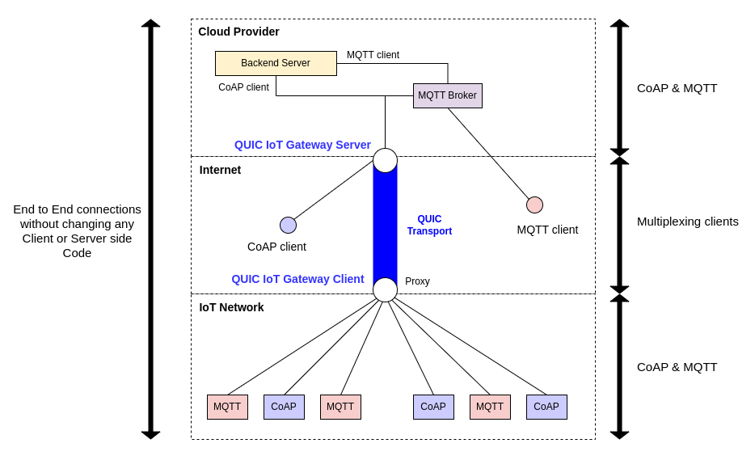
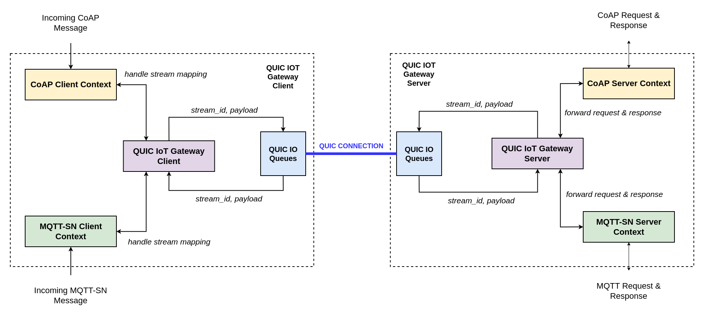
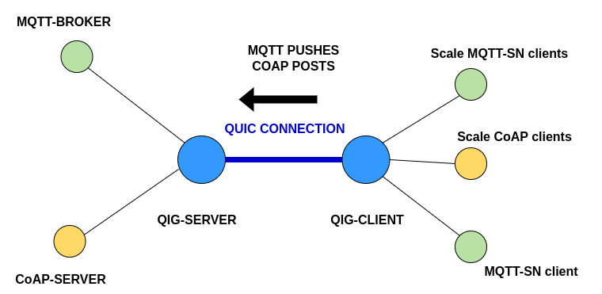

# quic-iot-gw
Multi-protocol aggregation over QUIC for IoT communication

## Overview
The core idea of the system is to map data from IoT devices to QUIC streams. This allows for multiplexing over the same
QUIC connection.

1. QUIC IoT Gateway Client/Server Pair for Transport
2. TLS1.3 IoT Gateway Client/Server Pair for Transport (developed for comparative analysis)
3. MQTT-SN Gateway Implementation based on Standard Document (Partial Compliance)
4. Contexts for Client/Server Pairs
   - MQTT-SN
   - CoAP
5. Single Threaded design using Asyncio programming paradigm
6. Bundled as PIP package

### Ideal deployment topology


### Software Architecture


## Installation
### Prerequisites - Certificate & Key
1. Can be found under `tests/certs`
2. Server certificate and private key can also be generated using:
  ```bash
  openssl req -new -newkey rsa:2048 -days 365 -nodes -x509 -keyout key.pem -out cert.pem
  ```
### Running simulation
1. A good starting point to see the system in action is to directly run simulation.
2. The logs can be analyzed to understand inner workings.
3. Since the simulation uses Docker-compose, you can also capture and analyze the traffic on 'iot' network (192.168.45.0/24).
4. Docker image for the simulation needs to be built separately
   - `make build-qig-image`
5. Use the makefile to start/stop simulation:
   - `make start-sim-qig`
   - `make stop-sim-qig`
#### Simulation environment topology:



[//]: # (docker build -f Dockerfile-ds -t demo-server .)

[//]: # (docker build -f Dockerfile-dc -t demo-client .)

[//]: # (docker compose -f docker-compose.simulation.yaml up -d)

[//]: # (docker compose -f docker-compose.simulation.yaml down)

[//]: # (docker inspect demo-server | less)